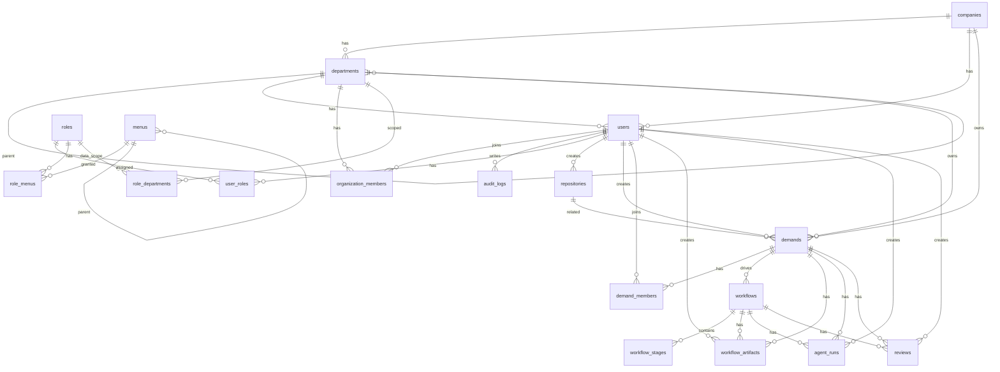

# 数据库 ER 图与表结构

本文档记录 OpenDevFlow 当前数据库表结构、字段说明与表关系。后续新增、修改、删除表或字段时，需要同步更新本文档，避免实现、迁移脚本和业务认知不一致。

当前基于 PostgreSQL，主键默认使用 `uuid`，大多数业务表包含 `created_at`、`updated_at`。

## 维护规则

- 新增表：补充 ER 图关系、字段清单、外键关系和业务说明。
- 修改字段：同步更新字段类型、是否必填、默认值、说明。
- 新增外键或关联表：同步更新 ER 图和“关系说明”。
- 修改权限、组织、工作流相关表时，优先检查是否影响数据权限、菜单权限、需求工作流链路。
- 表结构以 `backend/sql/*.sql` 和 `backend/app/models/*.py` 为准；生产或开发库存在历史迁移时，应以实际数据库结构复核。

## ER 图

## 关系说明

- `companies` 是公司主体，`departments` 是统一组织架构，使用 `org_type` 区分部门、项目组和开发组。
- `departments.parent_id` 自关联形成组织树，`ancestors` 存储祖先路径，用于快速查询下级组织架构。
- `users.company_id`、`users.department_id` 表示用户所属公司和组织架构。
- `organization_members` 表示开发组成员关系，用于支持一个用户参与多个开发组，并标记组长；需求创建时会按归属开发组初始化需求成员。
- `roles` 通过 `user_roles` 分配给用户。
- `roles` 通过 `role_menus` 绑定菜单、页面和按钮权限；`menus.permission` 是接口鉴权使用的权限标识。
- `role_departments` 用于角色数据范围为 `custom_dept` 时绑定可见组织架构。
- `demands` 是平台核心入口，关联公司、组织架构、创建人和可选代码仓库。
- `demand_members` 表示需求成员关系，用于表达单个需求内的负责人、产品、开发、测试和观察者。
- 每个 `demand` 可以对应多轮 `workflow`，`workflow_stages` 记录每一轮工作流的阶段状态。
- `workflow_artifacts`、`agent_runs`、`reviews` 都围绕需求和工作流产生。
- `audit_logs` 记录系统关键操作，`target_id` 不强制外键，便于记录不同类型对象。

## 表结构

### companies

公司表。

| 字段 | 类型 | 必填 | 默认值 | 说明 |
| --- | --- | --- | --- | --- |
| id | uuid | 是 | gen_random_uuid() | 主键 |
| name | varchar(120) | 是 |  | 公司名称 |
| code | varchar(80) | 是 |  | 公司编码，唯一 |
| status | varchar(20) | 是 | active | 状态 |
| created_at | timestamptz | 是 | now() | 创建时间 |
| updated_at | timestamptz | 是 | now() | 更新时间 |

### departments

组织架构表，兼容原部门表；通过 `org_type` 区分部门、项目组和开发组。

| 字段 | 类型 | 必填 | 默认值 | 说明 |
| --- | --- | --- | --- | --- |
| id | uuid | 是 | gen_random_uuid() | 主键 |
| company_id | uuid | 是 |  | 所属公司，外键 `companies.id` |
| parent_id | uuid | 否 |  | 上级组织架构，外键 `departments.id` |
| ancestors | text | 是 | '' | 祖先组织架构路径，逗号分隔 |
| name | varchar(120) | 是 |  | 组织架构名称 |
| order_num | integer | 是 | 0 | 排序 |
| status | varchar(20) | 是 | active | 状态 |
| created_at | timestamptz | 是 | now() | 创建时间 |
| updated_at | timestamptz | 是 | now() | 更新时间 |
| org_type | varchar(30) | 是 | department | 组织类型：`department` 部门，`project_group` 项目组，`dev_group` 开发组 |

层级规则：

- 根节点只允许 `department`。
- `department` 下允许挂 `department`、`project_group`、`dev_group`。
- `project_group` 下只允许挂 `dev_group`。
- `dev_group` 下不允许挂子级。

### users

用户表。

| 字段 | 类型 | 必填 | 默认值 | 说明 |
| --- | --- | --- | --- | --- |
| id | uuid | 是 | gen_random_uuid() | 主键 |
| username | varchar(80) | 是 |  | 登录用户名，唯一 |
| email | varchar(255) | 否 |  | 邮箱，唯一 |
| password_hash | varchar(255) | 是 |  | 密码哈希 |
| display_name | varchar(120) | 是 |  | 展示名称 |
| is_active | boolean | 是 | true | 是否启用 |
| last_login_at | timestamptz | 否 |  | 最后登录时间 |
| created_at | timestamptz | 是 | now() | 创建时间 |
| updated_at | timestamptz | 是 | now() | 更新时间 |
| company_id | uuid | 否 |  | 所属公司，外键 `companies.id` |
| department_id | uuid | 否 |  | 所属组织架构，外键 `departments.id` |

### roles

角色表。

| 字段 | 类型 | 必填 | 默认值 | 说明 |
| --- | --- | --- | --- | --- |
| id | uuid | 是 | gen_random_uuid() | 主键 |
| name | varchar(80) | 是 |  | 角色标识，唯一 |
| description | varchar(255) | 否 |  | 角色说明 |
| created_at | timestamptz | 是 | now() | 创建时间 |
| updated_at | timestamptz | 是 | now() | 更新时间 |
| data_scope | varchar(20) | 是 | self | 数据范围：`all`、`custom_dept`、`dept`、`dept_and_child`、`self` |

### menus

菜单权限表，用于配置目录、菜单和按钮权限。

| 字段 | 类型 | 必填 | 默认值 | 说明 |
| --- | --- | --- | --- | --- |
| id | uuid | 是 | gen_random_uuid() | 主键 |
| parent_id | uuid | 否 |  | 上级菜单，外键 `menus.id` |
| menu_name | varchar(120) | 是 |  | 菜单名称 |
| menu_type | varchar(1) | 是 |  | 菜单类型：`M` 目录，`C` 菜单，`F` 按钮 |
| path | varchar(255) | 否 |  | 前端路由地址 |
| component | varchar(255) | 否 |  | 前端组件标识 |
| permission | varchar(120) | 否 |  | 权限标识，用于接口鉴权 |
| icon | varchar(80) | 否 |  | 图标名称 |
| order_num | integer | 是 | 0 | 排序 |
| visible | boolean | 是 | true | 是否在菜单中显示 |
| status | varchar(20) | 是 | active | 状态 |
| created_at | timestamptz | 是 | now() | 创建时间 |
| updated_at | timestamptz | 是 | now() | 更新时间 |

### user_roles

用户角色关联表。

| 字段 | 类型 | 必填 | 默认值 | 说明 |
| --- | --- | --- | --- | --- |
| user_id | uuid | 是 |  | 用户 ID，外键 `users.id` |
| role_id | uuid | 是 |  | 角色 ID，外键 `roles.id` |

主键：`user_id, role_id`。

### role_menus

角色菜单关联表。

| 字段 | 类型 | 必填 | 默认值 | 说明 |
| --- | --- | --- | --- | --- |
| role_id | uuid | 是 |  | 角色 ID，外键 `roles.id` |
| menu_id | uuid | 是 |  | 菜单 ID，外键 `menus.id` |

主键：`role_id, menu_id`。

### role_departments

角色自定义数据范围组织架构关联表。

| 字段 | 类型 | 必填 | 默认值 | 说明 |
| --- | --- | --- | --- | --- |
| role_id | uuid | 是 |  | 角色 ID，外键 `roles.id` |
| department_id | uuid | 是 |  | 组织架构 ID，外键 `departments.id` |

主键：`role_id, department_id`。

### organization_members

开发组成员关联表，用于表达跨开发组成员和组长。该表只维护 `departments.org_type = dev_group` 的成员关系。

| 字段 | 类型 | 必填 | 默认值 | 说明 |
| --- | --- | --- | --- | --- |
| id | uuid | 是 | gen_random_uuid() | 主键 |
| department_id | uuid | 是 |  | 开发组 ID，外键 `departments.id` |
| user_id | uuid | 是 |  | 用户 ID，外键 `users.id` |
| member_role | varchar(20) | 是 | member | 成员角色：`leader` 组长，`member` 成员 |
| created_at | timestamptz | 是 | now() | 创建时间 |
| updated_at | timestamptz | 是 | now() | 更新时间 |

唯一约束：`department_id, user_id`。

### repositories

代码仓库表。

| 字段 | 类型 | 必填 | 默认值 | 说明 |
| --- | --- | --- | --- | --- |
| id | uuid | 是 | gen_random_uuid() | 主键 |
| name | varchar(120) | 是 |  | 仓库名称 |
| git_url | text | 否 |  | Git 地址 |
| default_branch | varchar(80) | 是 | main | 默认分支 |
| local_path | text | 否 |  | 本地路径 |
| description | text | 否 |  | 说明 |
| status | varchar(20) | 是 | active | 状态 |
| created_by | uuid | 否 |  | 创建人，外键 `users.id` |
| created_at | timestamptz | 是 | now() | 创建时间 |
| updated_at | timestamptz | 是 | now() | 更新时间 |

### demands

需求表，平台核心入口。

| 字段 | 类型 | 必填 | 默认值 | 说明 |
| --- | --- | --- | --- | --- |
| id | uuid | 是 | gen_random_uuid() | 主键 |
| title | varchar(255) | 是 |  | 需求标题 |
| type | varchar(50) | 是 |  | 需求类型：新业务、新项目、优化、Bugfix、重构等 |
| description | text | 是 |  | 需求描述 |
| expected_live_at | date | 否 |  | 期望上线时间 |
| repository_id | uuid | 否 |  | 关联仓库，外键 `repositories.id` |
| status | varchar(20) | 是 | active | 状态：`active`、`blocked`、`delivered`、`archived` |
| company_id | uuid | 是 |  | 所属公司，外键 `companies.id` |
| department_id | uuid | 是 |  | 归属开发组，外键 `departments.id` |
| created_by | uuid | 是 |  | 创建人，外键 `users.id` |
| created_at | timestamptz | 是 | now() | 创建时间 |
| updated_at | timestamptz | 是 | now() | 更新时间 |

### workflows

需求工作流表。

| 字段 | 类型 | 必填 | 默认值 | 说明 |
| --- | --- | --- | --- | --- |
| id | uuid | 是 | gen_random_uuid() | 主键 |
| demand_id | uuid | 是 |  | 需求 ID，外键 `demands.id`，一条需求可对应多轮工作流 |
| current_stage | varchar(50) | 是 | demand_created | 当前阶段 |
| status | varchar(20) | 是 | running | 状态：`running`、`blocked`、`done`、`archived` |
| created_at | timestamptz | 是 | now() | 创建时间 |
| updated_at | timestamptz | 是 | now() | 更新时间 |

### demand_members

需求成员关联表，用于表达单个需求内产品、开发、测试等职责；用户作为需求成员时，可在公司边界内查看该需求。

| 字段 | 类型 | 必填 | 默认值 | 说明 |
| --- | --- | --- | --- | --- |
| id | uuid | 是 | gen_random_uuid() | 主键 |
| demand_id | uuid | 是 |  | 需求 ID，外键 `demands.id` |
| user_id | uuid | 是 |  | 用户 ID，外键 `users.id` |
| member_role | varchar(30) | 是 | viewer | 需求角色：`owner`、`product_owner`、`dev_owner`、`developer`、`qa_owner`、`tester`、`viewer` |
| created_at | timestamptz | 是 | now() | 创建时间 |
| updated_at | timestamptz | 是 | now() | 更新时间 |

唯一约束：`demand_id, user_id`。

### workflow_stages

工作流阶段表。

| 字段 | 类型 | 必填 | 默认值 | 说明 |
| --- | --- | --- | --- | --- |
| id | uuid | 是 | gen_random_uuid() | 主键 |
| workflow_id | uuid | 是 |  | 工作流 ID，外键 `workflows.id` |
| stage_key | varchar(50) | 是 |  | 阶段标识 |
| stage_name | varchar(120) | 是 |  | 阶段名称 |
| sort_order | integer | 是 |  | 阶段排序 |
| status | varchar(20) | 是 | pending | 状态：`pending`、`current`、`passed`、`blocked`、`skipped` |
| started_at | timestamptz | 否 |  | 开始时间 |
| finished_at | timestamptz | 否 |  | 完成时间 |
| blocked_reason | text | 否 |  | 阻塞原因 |
| created_at | timestamptz | 是 | now() | 创建时间 |
| updated_at | timestamptz | 是 | now() | 更新时间 |

### workflow_artifacts

工作流产物表。

| 字段 | 类型 | 必填 | 默认值 | 说明 |
| --- | --- | --- | --- | --- |
| id | uuid | 是 | gen_random_uuid() | 主键 |
| demand_id | uuid | 是 |  | 需求 ID，外键 `demands.id` |
| workflow_id | uuid | 是 |  | 工作流 ID，外键 `workflows.id` |
| stage | varchar(50) | 是 |  | 所属阶段 |
| artifact_type | varchar(50) | 是 |  | 产物类型，如 PRD、用户故事、验收标准、设计、任务等 |
| title | varchar(255) | 是 |  | 产物标题 |
| content | text | 是 | '' | Markdown 内容 |
| version | integer | 是 | 1 | 版本号 |
| created_by | uuid | 是 |  | 创建人，外键 `users.id` |
| created_at | timestamptz | 是 | now() | 创建时间 |
| updated_at | timestamptz | 是 | now() | 更新时间 |

### agent_runs

Agent 执行记录表。

| 字段 | 类型 | 必填 | 默认值 | 说明 |
| --- | --- | --- | --- | --- |
| id | uuid | 是 | gen_random_uuid() | 主键 |
| demand_id | uuid | 是 |  | 需求 ID，外键 `demands.id` |
| workflow_id | uuid | 是 |  | 工作流 ID，外键 `workflows.id` |
| stage | varchar(50) | 是 |  | 所属阶段 |
| agent_type | varchar(50) | 是 | manual | Agent 类型：`manual`、`claude_code`、`codex_cli`、`other` |
| status | varchar(20) | 是 | pending | 状态：`pending`、`running`、`success`、`failed`、`blocked` |
| input_summary | text | 否 |  | 输入摘要 |
| output_summary | text | 否 |  | 输出摘要 |
| logs | text | 否 |  | 执行日志 |
| started_at | timestamptz | 否 |  | 开始时间 |
| finished_at | timestamptz | 否 |  | 结束时间 |
| exit_code | integer | 否 |  | 退出码 |
| blocker_reason | text | 否 |  | 阻塞原因 |
| created_by | uuid | 是 |  | 创建人，外键 `users.id` |
| created_at | timestamptz | 是 | now() | 创建时间 |
| updated_at | timestamptz | 是 | now() | 更新时间 |

### reviews

评审记录表。

| 字段 | 类型 | 必填 | 默认值 | 说明 |
| --- | --- | --- | --- | --- |
| id | uuid | 是 | gen_random_uuid() | 主键 |
| demand_id | uuid | 是 |  | 需求 ID，外键 `demands.id` |
| workflow_id | uuid | 是 |  | 工作流 ID，外键 `workflows.id` |
| stage | varchar(50) | 是 |  | 所属阶段 |
| review_type | varchar(50) | 是 |  | 评审类型 |
| result | varchar(20) | 是 |  | 评审结果 |
| comment | text | 否 |  | 评审意见 |
| created_by | uuid | 是 |  | 创建人，外键 `users.id` |
| created_at | timestamptz | 是 | now() | 创建时间 |
| updated_at | timestamptz | 是 | now() | 更新时间 |

### audit_logs

审计日志表。

| 字段 | 类型 | 必填 | 默认值 | 说明 |
| --- | --- | --- | --- | --- |
| id | uuid | 是 | gen_random_uuid() | 主键 |
| actor_user_id | uuid | 否 |  | 操作人，外键 `users.id` |
| action | varchar(120) | 是 |  | 操作动作 |
| target_type | varchar(80) | 否 |  | 目标类型 |
| target_id | uuid | 否 |  | 目标 ID，不强制外键 |
| metadata | jsonb | 是 | {} | 操作上下文 |
| created_at | timestamptz | 是 | now() | 创建时间 |

## 外键清单

| 来源表 | 字段 | 目标表 | 目标字段 | 删除规则 |
| --- | --- | --- | --- | --- |
| agent_runs | created_by | users | id | RESTRICT |
| agent_runs | demand_id | demands | id | CASCADE |
| agent_runs | workflow_id | workflows | id | CASCADE |
| audit_logs | actor_user_id | users | id | SET NULL |
| demand_members | demand_id | demands | id | CASCADE |
| demand_members | user_id | users | id | CASCADE |
| demands | company_id | companies | id | CASCADE |
| demands | created_by | users | id | RESTRICT |
| demands | department_id | departments | id | CASCADE |
| demands | repository_id | repositories | id | SET NULL |
| departments | company_id | companies | id | CASCADE |
| departments | parent_id | departments | id | CASCADE |
| menus | parent_id | menus | id | CASCADE |
| organization_members | department_id | departments | id | CASCADE |
| organization_members | user_id | users | id | CASCADE |
| repositories | created_by | users | id | SET NULL |
| reviews | created_by | users | id | RESTRICT |
| reviews | demand_id | demands | id | CASCADE |
| reviews | workflow_id | workflows | id | CASCADE |
| role_departments | department_id | departments | id | CASCADE |
| role_departments | role_id | roles | id | CASCADE |
| role_menus | menu_id | menus | id | CASCADE |
| role_menus | role_id | roles | id | CASCADE |
| user_roles | role_id | roles | id | CASCADE |
| user_roles | user_id | users | id | CASCADE |
| users | company_id | companies | id | SET NULL |
| users | department_id | departments | id | SET NULL |
| workflow_artifacts | created_by | users | id | RESTRICT |
| workflow_artifacts | demand_id | demands | id | CASCADE |
| workflow_artifacts | workflow_id | workflows | id | CASCADE |
| workflow_stages | workflow_id | workflows | id | CASCADE |
| workflows | demand_id | demands | id | CASCADE |

## 当前表清单

- 权限组织：`companies`、`departments`、`organization_members`、`users`、`roles`、`menus`、`user_roles`、`role_menus`、`role_departments`
- 需求交付：`repositories`、`demands`、`demand_members`、`workflows`、`workflow_stages`、`workflow_artifacts`、`agent_runs`、`reviews`
- 审计：`audit_logs`
